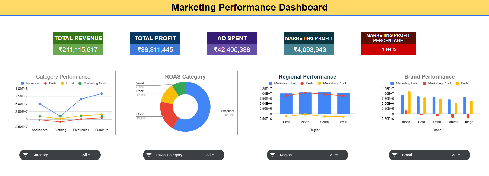

# SalesAndMarketingPerformanceAnalysis

# Marketing Performance Dashboard (Google Sheets)

Title:  Marketing Performance Dashboard

## Project Overview:

- This project presents an interactive Marketing & Sales Performance Dashboard built in Google Sheets. 
- It analyzes how advertising spend, discounts, pricing strategy, and competition impact revenue and profitability across brands, regions, and categories.
- The dashboard is designed to help business stakeholders quickly identify high-performing campaigns, risky ad spend, and profitability drivers.

## Objective:

- Evaluate marketing efficiency using ROAS {Return On Ad Spend}
- Identify profitable vs loss-making campaigns
- Compare brand and regional performance
- Analyze impact of discounts on sales
- Monitor customer satisfaction trends

## Tech Stack:

- Google Sheets  
- Pivot Tables  
- Charts  
- Advanced Formulas  
- Conditional Formatting  

## Dashboard Preview:

## Live Dashboard:
 [View Interactive Dashboard](https://docs.google.com/spreadsheets/d/1X7jfrCjxCMKsMBqbSjGeTLTrxaED4TahZSG_ygfddoE/edit?usp=sharing)

## Data & Methodology:

**Dataset:**  
- 5000 sales and marketing records  

**Columns Used:**  
Order_ID 
Brand 
Region 
Category	
Month	
Discount_Pct
Ad_Spend	
Customer_Rating
Competitor_Price_Index	
Units_Sold	
Price_Per_Unit	Revenue	
Profit

## Analysis Steps:

- Cleaned data to remove duplicates  
- Filled blanked Categorical values with **Unknown** and Numerical values with **Median of the column values**
- Created CPI buckets, ROAS categorization (Return on Ad Spend), Ad Spend Category, Marketing Profit Category
- Calculated Profit per unit, ROAS, Marketing Profit, Ad Revenue Percentage
- Built pivot tables for aggregation  
- Designed interactive dashboard for insights  

## Key Formulas:

1] CPI Buckets:
=IFS(I2<0.9,"Cheaper", AND(I2>=0.9,I2<0.98),"Slightly Cheaper", AND(I2>=0.98,I2<1.2),"Price Parity", AND(I2>=1.2, I2<1.1),"Slightly expensive", I2>=1.1, "Expensive")

2] Profit per unit:
=M2/J2
3] ROAS Category:

=IFS(P2>4, "Excellent", AND(P2>2,P2<=4),"Good", AND(P2>=1,P2<=2),"Weak",P2<1,"Poor")

4] Ad Spend Category:

=IFS(S2<20%,"Efficient", AND(S2>=20%,S2<30%),"Acceptable",AND(S2>=30%, S2<40%),"Heavy",S2>=40%,"Risky")

5] Market Profit Category:

=IFS(
R2<0,"Loss",
R2<=2000,"Low Profit",
R2<=5000,"Medium Profit",
TRUE,"High Profit"
)

## Dashboard Components:

Pivot Tables
Interactive Charts
KPI Cards
Slicers/Filters

##  Pivot Analysis:

-Price Parity products drive the highest demand (2,215 units), indicating customers prefer competitively priced items.
-Expensive products have the lowest sales (514 units), showing clear price sensitivity in the market.
-Cheaper and Slightly Cheaper segments still contribute meaningful volume, confirming a strong value-seeking customer base.
-Furniture and Electronics generate the majority of revenue, making them the primary business drivers.
-Profit margins are tightly clustered (~18%), suggesting standardized pricing and limited margin differentiation.
-Clothing delivers the highest margin (18.31%) despite lower revenue — a hidden profitability opportunity.
-Electronics has the lowest margin (18.06%) while contributing very high revenue — classic high-volume, lower-margin behavior.
-Regional customer ratings are very consistent (3.76–3.80), indicating stable customer experience across geographies.
-South region leads in unit sales (1,290), making it the volume stronghold.
-West region has the highest customer satisfaction (3.80) but not the highest sales, indicating untapped growth potential.

## Recommendations:

-Maintain price parity strategy for core products to protect volume leadership.
-Reassess pricing and positioning of expensive products to improve their demand.
-Increase marketing and assortment expansion in Clothing to leverage its superior margins.
-Optimize Electronics profitability through supplier negotiation, bundles, or accessory upsells.
-Focus customer experience improvements in the South to protect the highest-volume region.
-Increase marketing investment and distribution in the West to convert high satisfaction into higher sales.
-Consider category-level margin optimization since current margins are overly uniform.
-Run targeted promotions in value segments (Cheaper/Slightly Cheaper) to capture price-sensitive customers.
-Monitor CPI bucket trends over time to detect shifts in price sensitivity.
-Build region–category deep dives to identify localized growth opportunities.

## Key Performance Insights:

-Total Revenue is strong (₹211.1M), indicating healthy top-line performance.
-Total Profit (₹38.3M) is solid, but high Ad Spend (₹42.4M) is eroding marketing efficiency.
-Marketing Profit is negative (-₹4.09M) and Marketing Profit % is -1.94%, showing campaigns are currently unprofitable.
-ROAS distribution is skewed positive with ~58% in “Excellent,” but overall marketing profitability is still negative — suggesting overspending or misallocation.
-Furniture and Electronics dominate revenue contribution in Category Performance.
-Clothing shows relatively better profit efficiency compared to its revenue size — a margin opportunity.
-Regional performance shows marketing cost is high across all regions with only modest profit lift.
-North and South appear to generate stronger profit response to marketing compared to East and West.
-Brand Performance indicates Alpha and Beta generate strong profits, while Gamma and Omega show weaker marketing returns.
-Some brands have negative marketing profit despite decent revenue — indicating inefficient ad allocation.

 ## Executive Summary:
 
-Total revenue stands strong at ₹211.1M with total profit of ₹38.3M, indicating healthy core business performance.
-High ad spend of ₹42.4M has resulted in negative marketing profit (-₹4.09M) and a marketing profit margin of -1.94%.
-ROAS distribution appears favorable (majority in Excellent), but overall marketing efficiency is weak, suggesting budget misallocation.
-Furniture and Electronics are the primary revenue drivers.
-Clothing delivers the highest profit margin, indicating a high-margin growth opportunity.
-Price Parity products generate the highest unit sales, confirming customer price sensitivity.
-South region leads in sales volume, while West shows the highest customer satisfaction but lower relative sales.
-Brand performance is uneven — Alpha and Beta perform strongly, while Gamma and Omega lag in marketing returns.

## Strategic Recommendations:

-Immediately optimize Ad Spend allocation to stop negative marketing profit bleed.
-Reallocate budget toward high-ROAS campaigns (Excellent category) and cut Poor/Weak segments.
-Scale marketing investment behind Clothing and high-margin categories.
-Audit underperforming brands (Gamma, Omega) and reduce spend or fix targeting.
-Double down on high-performing brands (Alpha, Beta) with incremental budget tests.
-Investigate why strong ROAS distribution is not translating into positive marketing profit (possible high fixed costs or attribution gaps).
-Improve regional targeting — shift more budget toward North and South where profit response is stronger.
-Introduce CAC (Customer Acquisition Cost) and LTV tracking for deeper marketing efficiency analysis.
-Set guardrails: pause campaigns where Marketing Profit stays negative beyond threshold.
-Build a weekly ROAS and Marketing Profit monitoring view to catch inefficiencies early.

---

